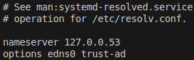
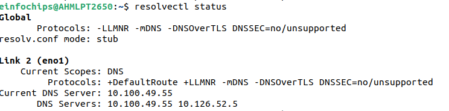
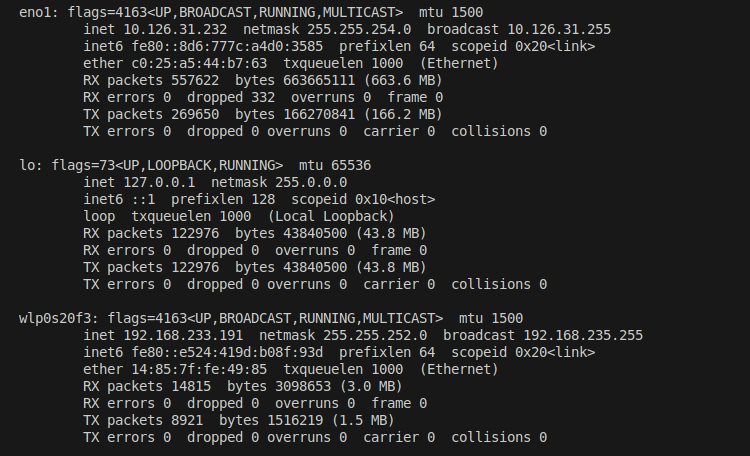
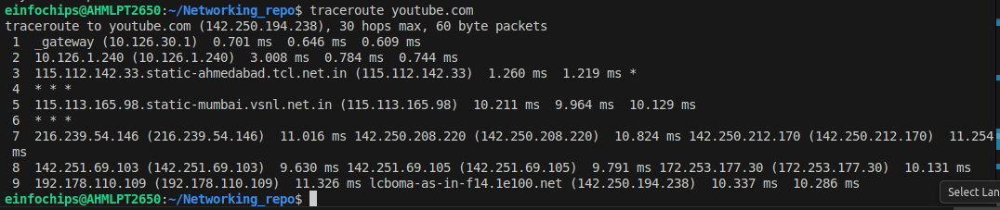

What is MAC Address
---

MAC Address is 12 character haxadecimal address and has attached to NIC.

```bash
ifconfig -a

# Look for en01 is your local.
# Look for ether - will have MAC Address like F0:24:1F:99:8J:48

ip link

# Look for link/ether
```

wireshark
---

- Wireshark is a free and open source `network protocol analyzer` or `sniffer`.
- Used to analyze the traffic passing through a computer network.
- It may be wired or wireless.

- wireshark allow you to **inspect individual packets** to see detailed informations including `source & dest`, `pkg size`, `type of data transmitted`.

- This info is useful for Troubleshooting network issues.

- Wiresharks supports protocols like **TCP/IP**, **DNS**, **HTTP** and many more.

DHCP
---

- DHCP (dynamic host configuration protocol) is nothing but a dynamically way to assign IP Address to Switch, Router on same network or diff network, as we did earlier using `ip addr add` and `route add`.

- It eliminates the need for manual configuration and ensuring devices can connect and communicate seamlessly.

- **DHCP Server** - A dedicated device or server that manages a pool of IP addresses and Assigns them to clients.

- **DHCP Client** - A device where we want to assign IP Address like SmartPhone, Laptop etc.

1. DHCP Client - Broadcast a DHCP DISCOVER pkg - Ask for Ip address to DHCP Server
2. DHCP Server - Server will give offer to client, "Hey!, I have this much of IP Addresses!. Do you wanna use it ?"

3. DHCP client - Will Request to DHCP Server, "Yes, Please! , Give me IP Address!"

4. DHCP Server - Will assign IP Address to client and Acknowledge it.

How DHCP Lease renewal works
---

what is `lease` ?
- Lease means, once ip has assgined to your device by DHCP Server, That IP will usable by your device till next 8 days only by default.

- Normally after 8 days it will expired, and your device will get a diff new ip address.

- However you want a static Ip address for long time, like ElasticIP.

- Here, DHCP lease renewal comes in picture.

## Renewal Process Timeline Std way

### 1. 50% - Day4 

  - While your lease duration used 50% time like 4 days.

  - Client will send a request to DHCP Server to renew my IP address. And Ask to renew same ip.

  - If `DHCP Server` is online - Lease will reset to next 8 days from 4 days.

  - Your IP Address keeps extending begore it expires untill your DHCP Server is online.

## 2. 87.5% - 6 Days

  - Somehow, your DHCP is not responding and offline, your DHCP Lease Renewal Request will failed.

  - Client will retries at 87.5% of lease, like on 6th days, it will retry to renew lease and ask to DHCP Server to renew the same ip.

  - If it succeeds - Lease renewed.

## 3. 100% - Expiratoin Day

  - If both attepmts was failed (On 50% and 87.5%), your lease will have been expired.

  - your device will get a **New different IP Address**.

Automatic Private IP Addressing (APIPA)
---

- This will automatically assign an IP Address to the devices while **DHCP is UnAvailable**.

- This is a settings in Mobile, Laptops.

- While DHCP is UnAvailable, Client (Devices) will automatically creates an IP Address from `169.254.X.X`

What is DNS Zones and DNS Records ?
---

- A `DNS zone` is a specific portion of DNS namespace that contains DNS Records.

- **DNS Zones Types**
  1. `Forward lookup zone` - Resolves Domain to IP -- google.com to 12.46.78.24

  2. `Reverse lookup zone` - Resolves IP to Domain -- 12.46.78.24 to google.com

**DNS Records**

  1. **A** - Stores Domain to IPv4
  `google.com → 142.250.183.14`

  2. **AAAA** - Stores Domains to IPv6
  `google.com → 2404:6800:4007:80f::200e`

  3. **MX** - Which mail server handles emails for that domains

```bash
dig google.com MX

# OUTPUT
google.com mail is handled by 10 smtp.google.com
```

  4. **CNAME** - Stores Alias records.

```bash
www.mycompany.com → mycompany.com
```
 
  5. **TXT** - Stores Text informations.

    - Domain Verifications
    - Google Verifications
    - AWS SES Verifications
    - SPF (email security)

  6. **NS** - Stores Name Server Records

  7. **SRV** - SRV Records used for:
    - VoIP Systems
    - Microsoft Active Directory
    - XMPP (Chat Servers)
    - Kubernetes Internal Services
    - LDAP

    Example:
    - Microsoft Active Directory heavily uses SRV records.

    - When a Windows machine joins a domain:

    `_ldap._tcp.dc._msdcs.domain.com`


    - It queries SRV record to find:

    - 👉 Which Domain Controller
    - 👉 On which port


How DNS Works ?
---

  1. While you ping or send request to any of domain, It will first look into `/etc/host` file.

```bash
192.168.1.115 test
```

  2. If it is found locally, it will never varify your local dns resolver.

  - Local dns resolver is located at `/etc/resolve.conf`



  - This order may change depend on how you configured `/etc/nsswitch.conf`

```bash

hosts:          files dns
networks:       files
```

  - hosts is configured with 1. files and 2. dns
  - So, Always it will varify in `/etc/host` (1. files) and then in the `/etc/resolve.conf` (2. dns).

  3. This is not your real dns server, this is just local dns resolver.


  - To check which is your dns server and assigning ips to your pc's network interfaces

```bash
resolvectl status
```



  - `Current DNS Server` is **10.100.49.55** is your Primary DNS Server.
  - Your Secondary DNS Server is **10.126.52.5**.

- So, Your dns flow will like this

```bash
Your App or Ping Query
   ↓
10.126.30.1 Default Gateway or Router
   ↓
127.0.0.53 (local DNS stub)
   ↓
10.100.49.55 (real corporate DNS server)
   ↓
Internet & Domain NS
   ↓
Youtube Server
```

**Step 1** - Know your PC IP and MAC

- Your PC has 2 diff IP & MAC, Wifi NIC and Ethernet NIC

```bash
# To know MAC and Private IP of your PC's NIC
ifconfig 

# To know only MAC Address of your PC's NIC
ip link
```



**Step 2** - Know your default gateway or router's MAC and IP.

```bash
ip route
# default via 10.126.30.1 dev eno1 proto dhcp metric 100 

ip neigh
# 10.126.30.1 dev eno1 lladdr 90:77:ee:a4:4a:89 REACHABLE
```

**Step 3** - Know which DHCP Server used by your PC

```bash
resolvectl
```


- While you send req to youtube.com it will first goes to default gateway `10.126.30.1` and look for youtube.com is available in local by `/etc/host`.

- If it is not available in `/etc/host` it will goes to `/etc/resolve.conf` -- loal dns resovler `127.0.0.53`based on how route defined in this `/etc/nsswitch.conf`.

- If it is not found in local dns resolver, it will goes to internet trhough router.

- Goes to Multiple Hops to Original DNS NS.

**Step 4** - Confirm to reach to DNS

```bash
traceroute youtube.com
```



```bash
9  192.178.110.109 (192.178.110.109)  11.326 ms lcboma-as-in-f14.1e100.net (142.250.194.238)  10.337 ms  10.286 ms
```

**lcboma-as-in-f14.1e100.net** is a Name Server Address and  **(142.250.194.238)** is a IP of youtube.com


Networking
---

Each devices has assigned network interface itslef by physical or virtual.
This is called MAC Address

To see this ip , use

```bash
ip link
```

**OUTPUT**

```bash
2: eno1: <BROADCAST,MULTICAST,UP,LOWER_UP> mtu 1500 qdisc fq_codel state UP mode DEFAULT group default qlen 1000
    link/ether c9:05:b5:42:j7:12 brd ff:ff:ff:ff:ff:ff
    altname enp1s0
```
- Here, `c9:05:b5:42:j7:12` is a MAC Address.

- We then assign the systems with IP Addresses on the same network. 
- It means, We will assign IP Address to this network `eno1`.
- for this we use,

```bash
ip addr add 10.126.31.232/23 dev eno1
```

- Varify this,

```bash
ip addr show eno1
```

**OUTPUT**

```bash
2: eno1: <BROADCAST,MULTICAST,UP,LOWER_UP> mtu 1500 qdisc fq_codel state UP group default qlen 1000
    link/ether c9:05:b5:42:j7:12 brd ff:ff:ff:ff:ff:ff
    altname enp1s0
    inet 10.126.31.232/23 brd 10.126.31.255 scope global dynamic noprefixroute eno1
       valid_lft 168710sec preferred_lft 168710sec
    inet6 fe80::8d6:777c:a4d0:3585/64 scope link noprefixroute 
       valid_lft forever preferred_lft forever
```

- Here, `inet` **`10.126.31.232/23`** is assigned IP Address.
- Also, `brd 10.126.31.255` is brodcast ip address to use for communicate from this network `eno1` to `other network`.

**Router** - helps to get connect 2 diff networks

- **Router** has connected to 2 diff networks. So, we would have to assign 2 diff ip address from 2 diff networks to this router for communications.


