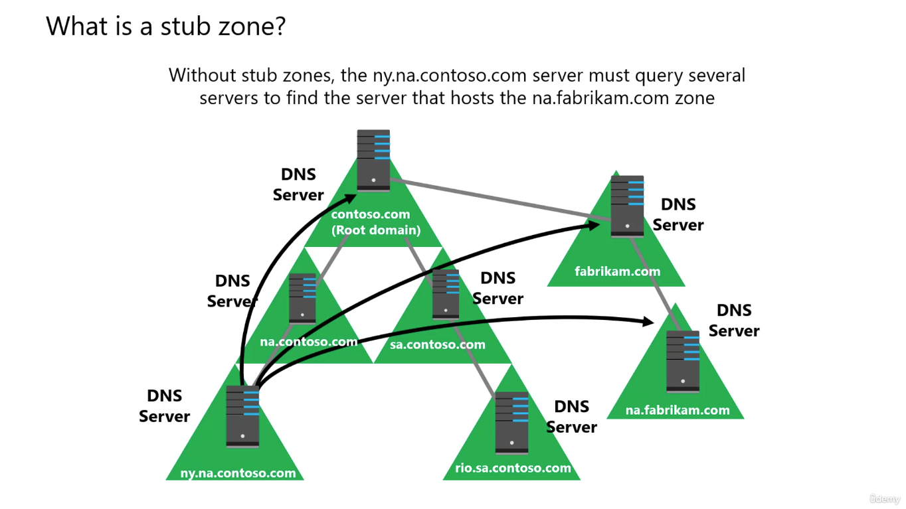
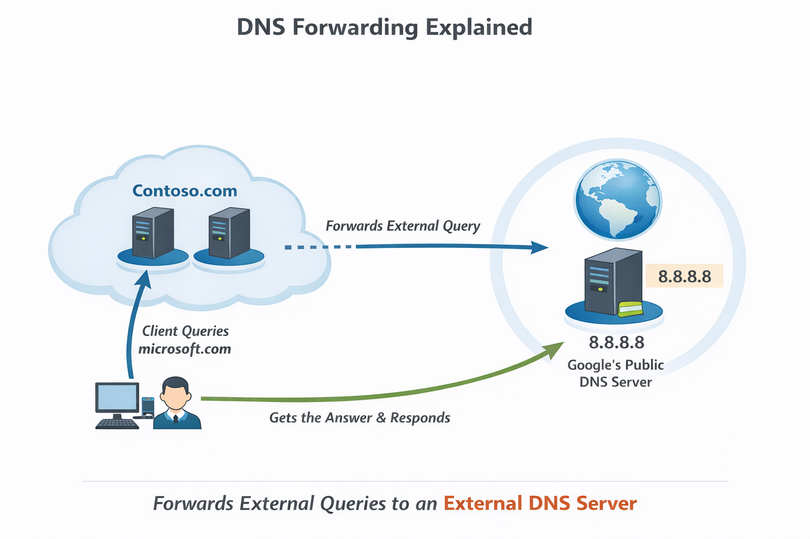
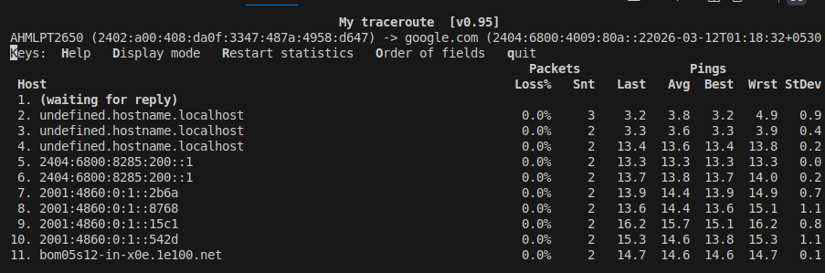
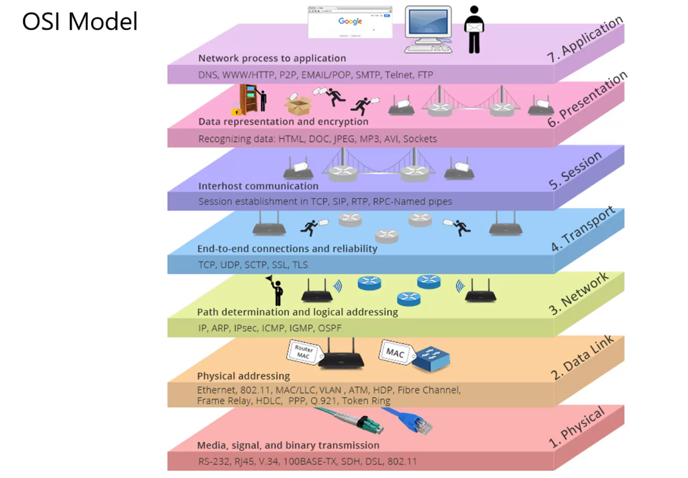
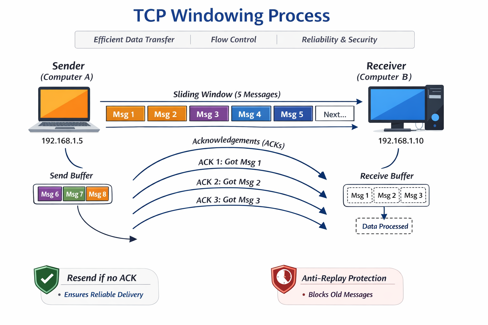
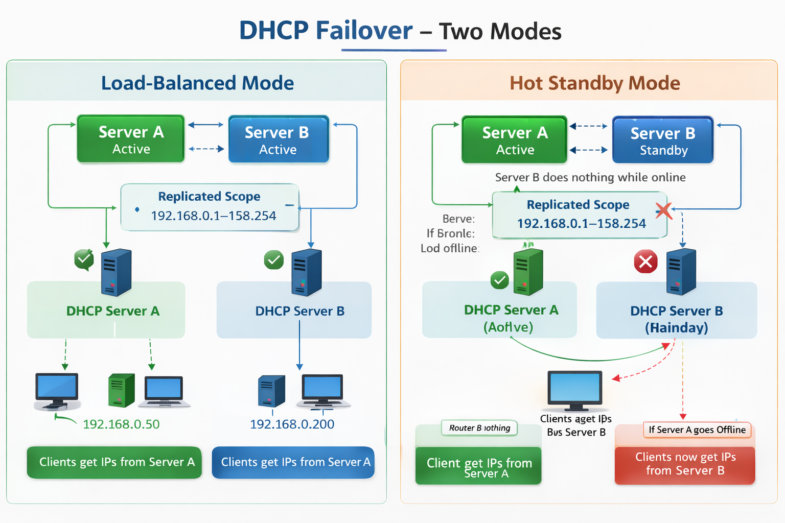
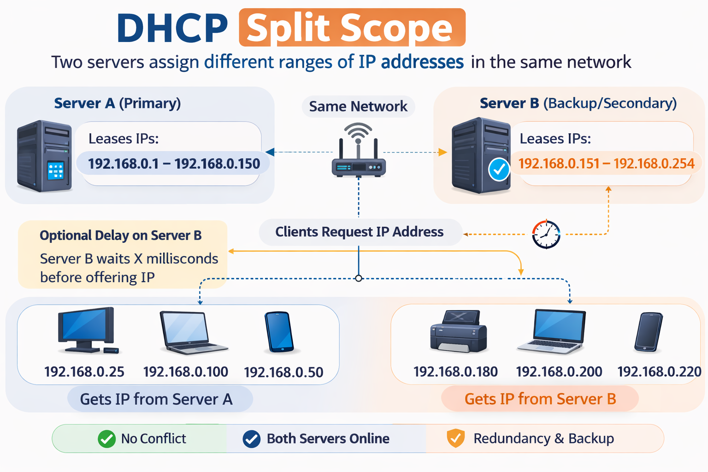

What is MAC Address
---

MAC Address is 12 character haxadecimal address and has attached to NIC.

```bash
ifconfig -a

# Look for en01 is your local.
# Look for ether - will have MAC Address like F0:24:1F:99:8J:48

ip link

# Look for link/ether
```

wireshark
---

- Wireshark is a free and open source `network protocol analyzer` or `sniffer`.
- Used to analyze the traffic passing through a computer network.
- It may be wired or wireless.

- wireshark allow you to **inspect individual packets** to see detailed informations including `source & dest`, `pkg size`, `type of data transmitted`.

- This info is useful for Troubleshooting network issues.

- Wiresharks supports protocols like **TCP/IP**, **DNS**, **HTTP** and many more.

DHCP
---

- DHCP (dynamic host configuration protocol) is nothing but a dynamically way to assign IP Address to Switch, Router on same network or diff network, as we did earlier using `ip addr add` and `route add`.

- It eliminates the need for manual configuration and ensuring devices can connect and communicate seamlessly.

- **DHCP Server** - A dedicated device or server that manages a pool of IP addresses and Assigns them to clients.

- **DHCP Client** - A device where we want to assign IP Address like SmartPhone, Laptop etc.

1. DHCP Client - Broadcast a DHCP DISCOVER pkg - Ask for Ip address to DHCP Server
2. DHCP Server - Server will give offer to client, "Hey!, I have this much of IP Addresses!. Do you wanna use it ?"

3. DHCP client - Will Request to DHCP Server, "Yes, Please! , Give me IP Address!"

4. DHCP Server - Will assign IP Address to client and Acknowledge it.

How DHCP Lease renewal works
---

what is `lease` ?
- Lease means, once ip has assgined to your device by DHCP Server, That IP will usable by your device till next 8 days only by default.

- Normally after 8 days it will expired, and your device will get a diff new ip address.

- However you want a static Ip address for long time, like ElasticIP.

- Here, DHCP lease renewal comes in picture.

## Renewal Process Timeline Std way

### 1. 50% - Day4 

  - While your lease duration used 50% time like 4 days.

  - Client will send a request to DHCP Server to renew my IP address. And Ask to renew same ip.

  - If `DHCP Server` is online - Lease will reset to next 8 days from 4 days.

  - Your IP Address keeps extending begore it expires untill your DHCP Server is online.

## 2. 87.5% - 6 Days

  - Somehow, your DHCP is not responding and offline, your DHCP Lease Renewal Request will failed.

  - Client will retries at 87.5% of lease, like on 6th days, it will retry to renew lease and ask to DHCP Server to renew the same ip.

  - If it succeeds - Lease renewed.

## 3. 100% - Expiratoin Day

  - If both attepmts was failed (On 50% and 87.5%), your lease will have been expired.

  - your device will get a **New different IP Address**.

Automatic Private IP Addressing (APIPA)
---

- This will automatically assign an IP Address to the devices while **DHCP is UnAvailable**.

- This is a settings in Mobile, Laptops.

- While DHCP is UnAvailable, Client (Devices) will automatically creates an IP Address from `169.254.X.X`

What is DNS Zones and DNS Records ?
---

- A `DNS zone` is a specific portion of DNS namespace that contains DNS Records.

- **DNS Zones Types**
  1. `Forward lookup zone` - Resolves Domain to IP -- google.com to 12.46.78.24

  2. `Reverse lookup zone` - Resolves IP to Domain -- 12.46.78.24 to google.com

**DNS Records**

  1. **A** - Stores Domain to IPv4
  `google.com → 142.250.183.14`

  2. **AAAA** - Stores Domains to IPv6
  `google.com → 2404:6800:4007:80f::200e`

  3. **MX** - Which mail server handles emails for that domains

```bash
dig google.com MX

# OUTPUT
google.com mail is handled by 10 smtp.google.com
```

  4. **CNAME** - Stores Alias records.

```bash
www.mycompany.com → mycompany.com
```
 
  5. **TXT** - Stores Text informations.

    - Domain Verifications
    - Google Verifications
    - AWS SES Verifications
    - SPF (email security)

  6. **NS** - Stores Name Server Records

  7. **SRV** - SRV Records used for:
    - VoIP Systems
    - Microsoft Active Directory
    - XMPP (Chat Servers)
    - Kubernetes Internal Services
    - LDAP

    Example:
    - Microsoft Active Directory heavily uses SRV records.

    - When a Windows machine joins a domain:

    `_ldap._tcp.dc._msdcs.domain.com`


    - It queries SRV record to find:

    - 👉 Which Domain Controller
    - 👉 On which port


How DNS Works ?
---

  1. While you ping or send request to any of domain, It will first look into `/etc/host` file.

```bash
192.168.1.115 test
```

  2. If it is found locally, it will never varify your local dns resolver.

  - Local dns resolver is located at `/etc/resolve.conf`


  - This order may change depend on how you configured `/etc/nsswitch.conf`

```bash

hosts:          files dns
networks:       files
```

  - hosts is configured with 1. files and 2. dns
  - So, Always it will varify in `/etc/host` (1. files) and then in the `/etc/resolve.conf` (2. dns).

  3. This is not your real dns server, this is just local dns resolver.


  - To check which is your dns server and assigning ips to your pc's network interfaces

```bash
resolvectl status
```


  - `Current DNS Server` is **10.100.49.55** is your Primary DNS Server.
  - Your Secondary DNS Server is **10.126.52.5**.

- So, Your dns flow will like this

```bash
Your App or Ping Query
   ↓
10.126.30.1 Default Gateway or Router
   ↓
127.0.0.53 (local DNS stub)
   ↓
10.100.49.55 (real corporate DNS server)
   ↓
Internet & Domain NS
   ↓
Youtube Server
```

**Step 1** - Know your PC IP and MAC

- Your PC has 2 diff IP & MAC, Wifi NIC and Ethernet NIC

```bash
# To know MAC and Private IP of your PC's NIC
ifconfig 

# To know only MAC Address of your PC's NIC
ip link
```


**Step 2** - Know your default gateway or router's MAC and IP.

```bash
ip route
# default via 10.126.30.1 dev eno1 proto dhcp metric 100 

ip neigh
# 10.126.30.1 dev eno1 lladdr 90:77:ee:a4:4a:89 REACHABLE
```

**Step 3** - Know which DHCP Server used by your PC

```bash
resolvectl
```


- While you send req to youtube.com it will first goes to default gateway `10.126.30.1` and look for youtube.com is available in local by `/etc/host`.

- If it is not available in `/etc/host` it will goes to `/etc/resolve.conf` -- loal dns resovler `127.0.0.53`based on how route defined in this `/etc/nsswitch.conf`.

- If it is not found in local dns resolver, it will goes to internet trhough router.

- Goes to Multiple Hops to Original DNS NS.

**Step 4** - Confirm to reach to DNS

```bash
traceroute youtube.com
```


```bash
9  192.178.110.109 (192.178.110.109)  11.326 ms lcboma-as-in-f14.1e100.net (142.250.194.238)  10.337 ms  10.286 ms
```

**lcboma-as-in-f14.1e100.net** is a Name Server Address and  **(142.250.194.238)** is a IP of youtube.com


Networking
---

Each devices has assigned network interface itslef by physical or virtual.
This is called MAC Address

To see this ip , use

```bash
ip link
```

**OUTPUT**

```bash
2: eno1: <BROADCAST,MULTICAST,UP,LOWER_UP> mtu 1500 qdisc fq_codel state UP mode DEFAULT group default qlen 1000
    link/ether c9:05:b5:42:j7:12 brd ff:ff:ff:ff:ff:ff
    altname enp1s0
```
- Here, `c9:05:b5:42:j7:12` is a MAC Address.

- We then assign the systems with IP Addresses on the same network. 
- It means, We will assign IP Address to this network `eno1`.
- for this we use,

```bash
ip addr add 10.126.31.232/23 dev eno1
```

- Varify this,

```bash
ip addr show eno1
```

**OUTPUT**

```bash
2: eno1: <BROADCAST,MULTICAST,UP,LOWER_UP> mtu 1500 qdisc fq_codel state UP group default qlen 1000
    link/ether c9:05:b5:42:j7:12 brd ff:ff:ff:ff:ff:ff
    altname enp1s0
    inet 10.126.31.232/23 brd 10.126.31.255 scope global dynamic noprefixroute eno1
       valid_lft 168710sec preferred_lft 168710sec
    inet6 fe80::8d6:777c:a4d0:3585/64 scope link noprefixroute 
       valid_lft forever preferred_lft forever
```

- Here, `inet` **`10.126.31.232/23`** is assigned IP Address.
- Also, `brd 10.126.31.255` is brodcast ip address to use for communicate from this network `eno1` to `other network`.

**Router** - helps to get connect 2 diff networks

- **Router** has connected to 2 diff networks. So, we would have to assign 2 diff ip address from 2 diff networks to this router for communications.

# DNS Zone Types

## Purpose

Understand the four Windows DNS zone types and when to use them.

## DNS Zone

A DNS zone stores DNS records for a domain such as A, CNAME, MX, etc.

## 1. Primary Zone

Primary zone is the main read-write copy of DNS records.

Characteristics:

* Stores the master DNS records
* Administrators can add, edit, or delete records
* Other DNS servers copy from this zone

Use Case:
Used as the main DNS server where records are managed.

## 2. Secondary Zone

Secondary zone is a read-only copy of a primary zone.

Characteristics:

* Records cannot be modified
* Receives updates from the primary server
* Used to reduce load on the primary server

Use Case:
Useful for branch offices to reduce WAN traffic.

## 3. Active Directory Integrated Zone

DNS data is stored inside Active Directory.

Characteristics:

* Replicates automatically using AD replication
* Multiple DNS servers can update records
* Requires DNS server to be a domain controller

Use Case:
Recommended option when Active Directory is available.

## 4. Stub Zone

Stub zone stores only limited DNS information.

Characteristics:

* Stores NS records
* Helps locate authoritative DNS servers
* Does not store full DNS records

Use Case:
Used to speed up DNS lookups and maintain delegation.

## Quick Comparison

| Zone Type     | Read/Write | Stores Full Records | Replication Method           |
| ------------- | ---------- | ------------------- | ---------------------------- |
| Primary       | Yes        | Yes                 | Manual / Zone Transfer       |
| Secondary     | No         | Yes                 | Zone Transfer                |
| AD Integrated | Yes        | Yes                 | Active Directory Replication |
| Stub          | No         | No                  | Maintains NS Records         |

## Key Takeaway

* Primary = Main DNS database
* Secondary = Read-only copy for redundancy and performance
* AD Integrated = Best option in Windows domain environments
* Stub = Helps locate authoritative DNS servers

Understanding these helps design reliable DNS infrastructure in enterprise environments.


# Active Directory–Integrated DNS Zones

## Overview

Active Directory–integrated zones simplify DNS management by combining DNS data storage with **Active Directory replication and security features**.

## 1. What Is an Active Directory–Integrated DNS Zone?

An **Active Directory–integrated DNS zone** stores DNS records directly inside **Active Directory (AD)** instead of using a traditional DNS zone file.

Because DNS data is stored in Active Directory, it automatically replicates between **domain controllers** that run the DNS service.

This architecture removes the dependency on traditional **primary and secondary DNS server roles**.

Key idea:

* DNS data becomes part of the **Active Directory database**
* Replication is handled by **Active Directory replication mechanisms**
* Multiple DNS servers can host and manage the same zone

## 2. Multi-Master DNS Updates

In traditional DNS configurations:

* **Primary DNS server** → the only server allowed to make changes
* **Secondary DNS server** → read-only copy of the primary

With **Active Directory–integrated DNS**:

* Any DNS server hosting the zone can **create, modify, or delete DNS records**
* There is **no single authoritative write server**

This model is known as **multi-master replication**.

### Benefits

* Eliminates a single point of failure
* Any domain controller can process DNS updates
* Improves DNS availability and resilience

## 3. Replication Through Active Directory

DNS records stored in Active Directory replicate using the **existing Active Directory replication topology**.

### Characteristics

* Replication follows **Active Directory site and replication rules**
* Updates are **incremental**
* Only **changed records** are replicated between domain controllers

### Benefits

* Efficient network utilization
* Faster propagation of DNS changes
* No manual **zone transfers** required

## 4. Secure Dynamic DNS Updates

Active Directory–integrated zones support **secure dynamic DNS updates**.

This means:

* Only **domain-joined computers** are allowed to automatically register DNS records
* Unauthorized or unmanaged devices cannot create DNS entries

### Example

When a computer joins the domain, it can automatically register its DNS record:

```
computer01.company.local → 10.10.1.25
```

### Security Advantage

Secure updates prevent devices such as:

* Personal laptops
* Mobile phones
* Unmanaged systems

from automatically creating DNS records that could pollute the DNS database.

Administrators can disable secure updates if they want **all devices** to be allowed to register DNS records.

## 5. Why Active Directory–Integrated DNS Zones Are Preferred

In most enterprise Windows environments, **Active Directory–integrated DNS zones are the recommended configuration** because they provide:

* Automatic replication
* Multi-master DNS updates
* Improved security
* Reduced administrative overhead

### Comparison With Traditional DNS Zones

| Feature               | Traditional DNS (Primary/Secondary) | AD–Integrated DNS            |
| --------------------- | ----------------------------------- | ---------------------------- |
| Write Capability      | Only Primary Server                 | Any DNS Server               |
| Replication Method    | Zone Transfer                       | Active Directory Replication |
| Security              | Basic                               | Secure Dynamic Updates       |
| Administrative Effort | Higher                              | Lower                        |

## 6. Typical Enterprise Architecture

Example Windows domain architecture using AD-integrated DNS:

```
        Domain Controller 1
        DNS Server
             │
             │  Active Directory Replication
             │
        Domain Controller 2
        DNS Server
             │
             │  Active Directory Replication
             │
        Domain Controller 3
        DNS Server
```

All DNS servers in this environment:

* Host the same DNS zone
* Allow record updates
* Replicate DNS changes automatically through Active Directory

## 7. Key Takeaways

* Active Directory–integrated DNS stores DNS data **inside Active Directory**
* Supports **multi-master DNS updates**
* Uses **Active Directory replication** instead of zone transfers
* Provides **secure dynamic DNS updates**
* Recommended DNS configuration for **Windows domain environments**

# DNS Stub Zone

## Overview

A **Stub Zone** is a lightweight DNS zone that contains only the minimum information required to locate the **authoritative DNS servers** for another zone. Instead of storing every DNS record, it stores a small subset of records that allow your DNS server to determine where to send queries.

Stub zones are commonly used in environments with **multiple domains or forests** where DNS servers need to resolve names across domains without replicating and storing all records locally.

## One‑Line Definition

A **Stub Zone** is a DNS zone that stores only the **NS (Name Server) records and related authority information** for another DNS zone so that your DNS server knows which authoritative server to query.

## Simple Analogy

Think of a full DNS zone as a **complete phonebook** containing every person's phone number in a city.

A **stub zone** is like a **directory assistance page** that only lists the phone numbers of the offices that manage the phonebook. When you need someone's number, you call the directory office instead of carrying the entire phonebook.

This keeps your local "phonebook" very small while still allowing you to find any number when needed.





## Records Contained in a Stub Zone

A stub zone typically contains only a small number of DNS record types:

* **SOA (Start of Authority)** — Identifies the primary DNS server responsible for the zone
* **NS (Name Server) Records** — Lists the authoritative DNS servers for that zone
* **Glue A Records** — Provides the IP addresses of those authoritative name servers

A stub zone **does NOT contain standard host records**, such as:

* A records
* AAAA records
* MX records
* TXT records
* CNAME records

Because of this, stub zones remain **very small and lightweight**.

## How Stub Zones Work (Step‑by‑Step)

Example scenario with two domains:

* **contoso.com**
* **fabrikam.com**

### Name Resolution Flow

1. A DNS server in **contoso.com** receives a query for a hostname in **fabrikam.com**.
2. Instead of storing every host record for fabrikam.com, the DNS server maintains a **stub zone** for that domain.
3. The stub zone contains the **NS records** that identify fabrikam.com's authoritative DNS servers.
4. The contoso DNS server checks the stub zone to locate those authoritative servers.
5. It sends the DNS query directly to one of the fabrikam DNS servers.
6. The authoritative server returns the correct DNS record.
7. The contoso DNS server forwards the response back to the client.

This process enables **cross-domain resolution without replicating the entire zone**.

## DNS Resolution Diagram (Stub Zone Example)

```
Client
   |
   | DNS Query: app.fabrikam.com
   v
+----------------------+
| Contoso DNS Server   |
| (Contains Stub Zone) |
+----------------------+
           |
           | Checks Stub Zone
           | Finds NS records
           v
   +----------------------+
   | Fabrikam DNS Server  |
   | (Authoritative)      |
   +----------------------+
           |
           | Returns A Record
           v
Contoso DNS Server -> Client
```

The stub zone acts as a **pointer that tells the DNS server where to ask the question**.

## Why Use Stub Zones

### 1. Reduced Replication Traffic

Stub zones prevent thousands of DNS records from being replicated across WAN links.

### 2. Minimal Storage Requirements

Only a few authority records are stored locally, keeping the DNS database small.

### 3. Automatic Discovery of DNS Servers

If authoritative name servers change, the stub zone can update the **NS record list automatically**.

### 4. Efficient Cross‑Domain Name Resolution

DNS servers can locate the correct authoritative DNS server without storing the entire zone.

## When Not to Use Stub Zones

Stub zones may not be the best option when:

* A **complete local copy** of all DNS records is required
* DNS resolution must continue even if **authoritative servers are temporarily unreachable**
* Very **high‑performance local DNS resolution** is required for all records

In these cases, a **Secondary Zone** may be more appropriate.


## Stub Zones in Active Directory Environments

In **Active Directory environments**, stub zones are frequently used to support **cross-domain DNS resolution** without replicating all DNS records between domains.

Advantages in AD environments include:

* Reduced Active Directory replication traffic
* Lightweight DNS infrastructure
* Accurate awareness of authoritative DNS servers

This makes stub zones useful in **multi-domain forests**.

## Key Takeaways

* Stub zones store **only minimal DNS authority information**.
* They allow DNS servers to **locate authoritative name servers** for another zone.
* They reduce **replication overhead, storage requirements, and WAN traffic**.
* They are commonly used in **multi-domain or Active Directory environments**.

## Quick Summary

| Feature                          | Stub Zone  |
| -------------------------------- | ---------- |
| Stores all DNS records           | No         |
| Stores NS records                | Yes        |
| Stores SOA record                | Yes        |
| Used for cross-domain resolution | Yes        |
| Replication size                 | Very small |

# DNS Forwarding

## One-Line Summary

DNS **forwarding** means a local DNS server sends queries it cannot resolve to another DNS server (called a **forwarder**) instead of resolving them itself using root servers.

---

## How DNS Forwarding Works

1. A client device sends a DNS query (for example `microsoft.com`) to the **local DNS server**.
2. The local DNS server checks whether it can resolve the query locally (for example internal domain records).
3. If the record is not found, the DNS server **forwards the query** to a configured external DNS resolver.
4. The external resolver performs the DNS lookup (or returns a cached result).
5. The result is sent back to the local DNS server and then returned to the client.

---

## Example Forwarders

Common public DNS forwarders include:

* **8.8.8.8** – Google Public DNS
* **8.8.4.4** – Google Public DNS

---

## DNS Forwarding Flow

```
Client → Local DNS Server → Forwarder (External DNS) → Internet DNS Servers
          (forwards query)      (performs lookup / returns cached result)
```



## Why DNS Forwarding Is Faster

* Public DNS resolvers maintain **large caches** for frequently requested domains.
* Queries for common domains can be answered immediately from cache.
* The local DNS server avoids performing full recursive lookups.

## Advantages

* Faster resolution for common internet domains
* Reduced workload on the local DNS server
* Simple configuration

## Considerations

* DNS queries are sent to external servers (privacy considerations).
* Reliance on external DNS availability.
* Internal DNS zones should not be forwarded.

# Networking Commands (Equivalent to Windows ipconfig)

## Overview

In Ubuntu (Linux), the `ipconfig` command used in Windows does not exist. Linux uses different networking tools that provide the same functionality and often more detailed information.

This document maps common Windows `ipconfig` commands to their Ubuntu equivalents and explains how to use them for basic network troubleshooting.

---

## Windows vs Ubuntu Networking Commands

| Windows Command      | Ubuntu Equivalent                      |
| -------------------- | -------------------------------------- |
| ipconfig             | ip addr or ip a                        |
| ipconfig /all        | ip addr + ip route + resolvectl status |
| ipconfig /release    | dhclient -r                            |
| ipconfig /renew      | dhclient                               |
| ipconfig /displaydns | resolvectl statistics                  |
| ipconfig /flushdns   | sudo resolvectl flush-caches           |

---

## 1. Check IP Address

### Command

```
ip a
```

or

```
ip addr
```

### Example Output

```
2: wlp2s0: <BROADCAST,MULTICAST,UP>
    inet 192.168.1.105/24
    inet6 fe80::9f3:21ff:fe4a:1b2
```

### Explanation

| Field  | Meaning           |
| ------ | ----------------- |
| wlp2s0 | Network interface |
| inet   | IPv4 address      |
| inet6  | IPv6 address      |
| /24    | Subnet mask       |

Example:

```
192.168.1.105/24
```

Means:

```
IP Address: 192.168.1.105
Subnet Mask: 255.255.255.0
```

---

## 2. Check Default Gateway

### Command

```
ip route
```

### Example Output

```
default via 192.168.1.1 dev wlp2s0
```

| Field       | Meaning          |
| ----------- | ---------------- |
| default     | Internet route   |
| 192.168.1.1 | Router / Gateway |
| wlp2s0      | Interface        |

---

## 3. Check DNS Server

### Commands

```
resolvectl status
```

or

```
cat /etc/resolv.conf
```

### Example

```
nameserver 192.168.1.1
nameserver 8.8.8.8
```

| Value       | Meaning    |
| ----------- | ---------- |
| 192.168.1.1 | Router DNS |
| 8.8.8.8     | Google DNS |

---

## 4. DHCP Concept

Ubuntu usually receives network configuration automatically using DHCP.

DHCP provides:

* IP Address
* Subnet Mask
* Default Gateway
* DNS Server

These settings are typically assigned by a router, ISP modem, or enterprise DHCP server.

---

## 5. Release IP Address

### Command

```
sudo dhclient -r
```

This releases the currently assigned IP address from the DHCP server.

Verify:

```
ip a
```

---

## 6. Renew IP Address

### Command

```
sudo dhclient
```

The system requests a new IP address from the DHCP server.

---

## 7. View DNS Cache Statistics

### Command

```
resolvectl statistics
```

Shows DNS cache metrics such as cache hits, misses, and queries.

---

## 8. Flush DNS Cache

### Command

```
sudo resolvectl flush-caches
```

Clears stored DNS records from the local cache.

This is useful if DNS records have changed but the system still resolves to an old IP address.

---

## 9. Basic Network Troubleshooting Steps

### Check IP

```
ip a
```

### Check Gateway

```
ip route
```

### Check DNS

```
cat /etc/resolv.conf
```

### Test Gateway

```
ping 192.168.1.1
```

### Test Internet

```
ping 8.8.8.8
```

### Test DNS Resolution

```
ping google.com
```

---

## 10. Quick Command Cheat Sheet

| Purpose          | Command                      |
| ---------------- | ---------------------------- |
| Check IP address | ip a                         |
| Check routes     | ip route                     |
| Check DNS        | cat /etc/resolv.conf         |
| Release IP       | sudo dhclient -r             |
| Renew IP         | sudo dhclient                |
| Flush DNS cache  | sudo resolvectl flush-caches |
| Test gateway     | ping 192.168.1.1             |
| Test internet    | ping 8.8.8.8                 |


# Linux Ping Command (Ubuntu) – Complete Guide

## Overview

`ping` is a network troubleshooting utility used to verify connectivity between two systems. It sends an **ICMP Echo Request** to a target host and waits for an **ICMP Echo Reply**. If replies are received, the network path between the systems is working.

---

## How Ping Works

1. Your system sends an **ICMP Echo Request** packet to the destination.
2. The destination device responds with an **ICMP Echo Reply**.
3. Successful replies indicate working network connectivity.
4. No reply may indicate a network, routing, firewall, or DNS issue.

Example:

```bash
ping google.com
```

Example Output:

```
PING google.com (142.250.183.14) 56(84) bytes of data.
64 bytes from 142.250.183.14: icmp_seq=1 ttl=117 time=22 ms
64 bytes from 142.250.183.14: icmp_seq=2 ttl=117 time=20 ms
```

### Output Fields

| Field    | Description                     |
| -------- | ------------------------------- |
| icmp_seq | Packet sequence number          |
| ttl      | Time To Live (remaining hops)   |
| time     | Round‑trip time between systems |

---

## Default Behavior: Linux vs Windows

| System  | Default Behavior                |
| ------- | ------------------------------- |
| Windows | Sends 4 packets then stops      |
| Linux   | Runs continuously until stopped |

Stop continuous ping in Linux using:

```
Ctrl + C
```

Example summary:

```
--- google.com ping statistics ---
5 packets transmitted, 5 received, 0% packet loss
```

---

## Send a Specific Number of Packets

Linux uses the `-c` (count) option to control the number of packets.

```bash
ping -c 4 google.com
```

Result:

```
4 packets transmitted, 4 received
```

---

## Ping an IP Address

```bash
ping 8.8.8.8
```

If replies are received, internet connectivity is working.

---

## Hostname Resolution

Linux automatically attempts to resolve hostnames when pinging an IP address.

Example:

```bash
ping 192.168.1.1
```

Possible output:

```
PING router.local (192.168.1.1)
```

---

## Force IPv4

```bash
ping -4 google.com
```

Forces the command to use **IPv4 only**.

---

## Force IPv6

```bash
ping -6 google.com
```

Forces the command to use **IPv6 only**.

---

## TTL (Time To Live)

TTL represents the maximum number of network hops a packet can travel before being discarded.

Each router decreases the TTL value by **1**.

Example:

```
ttl=117
```

This indicates the packet passed through multiple routers before reaching the destination.

---

## Basic Network Troubleshooting Workflow

### 1. Test Local Network (Gateway)

```bash
ping 192.168.1.1
```

If successful, your system can reach the router.

### 2. Test Internet Connectivity

```bash
ping 8.8.8.8
```

If successful, internet connectivity is available.

### 3. Test DNS Resolution

```bash
ping google.com
```

If this fails but the IP ping works, the issue is likely related to DNS.

---

## DNS Troubleshooting Example

Problem: Internet websites are not opening.

Test connectivity:

```bash
ping 8.8.8.8
```

If successful, internet connectivity exists.

Test DNS:

```bash
ping google.com
```

If you see:

```
ping: google.com: Temporary failure in name resolution
```

Conclusion: DNS configuration or DNS server issue.

## DNS Load Balancing (Round Robin)

Running:

```bash
ping google.com
```

May return different IP addresses such as:

```
142.250.183.14
142.250.183.46
142.250.183.78
```

This technique is called **DNS Round Robin**, which distributes traffic across multiple servers for:

* Load balancing
* High availability
* Fault tolerance

## Useful Ping Commands

| Command              | Purpose                      |
| -------------------- | ---------------------------- |
| ping google.com      | Continuous connectivity test |
| ping -c 4 google.com | Send 4 packets               |
| ping -4 google.com   | Force IPv4                   |
| ping -6 google.com   | Force IPv6                   |
| ping 8.8.8.8         | Test internet connectivity   |
| ping 192.168.1.1     | Test router / gateway        |

TraceRoute & MTR
---

**TraceRoute** - To show you that from how many hops your request goes and finally reach to DNS server to resolve name to ip.

```bash
traceroute google.com
```


**mtr** - Is shows pkg loss and send / received by all hops from where your requests was goes.

```bash
mtr google.com
```




OSI Model
---



# OSI Model Explained for DevOps Engineers

## Overview

The **Open Systems Interconnection (OSI) model** is a conceptual framework that explains how data moves between two devices over a network.

It divides networking into **7 layers**, where each layer has a specific responsibility.

Understanding the OSI model helps engineers **troubleshoot network problems quickly**.

---

## The 7 OSI Layers

### Layer 7 — Application

User-facing network services and applications.

Examples:

* HTTP
* HTTPS
* FTP
* SSH
* SMTP

Example scenario:
Opening a website in a browser.

---

### Layer 6 — Presentation

Responsible for **data formatting, encoding, compression, and encryption**.

Examples:

* TLS/SSL encryption
* JPEG
* MP3

This layer ensures data from the application can be understood by the receiving system.

---

### Layer 5 — Session

Manages communication sessions between devices.

Responsibilities:

* Session creation
* Session maintenance
* Session termination

Example:
A long-lived SSH session.

---

### Layer 4 — Transport

Provides **end-to-end communication between hosts**.

Responsibilities:

* Port numbers
* Reliability
* Flow control
* Segmentation

Protocols:

* TCP (reliable)
* UDP (fast but unreliable)

Examples:

* HTTP uses TCP
* DNS often uses UDP

---

### Layer 3 — Network

Responsible for **logical addressing and routing packets between networks**.

Examples:

* IPv4
* IPv6

Devices:

* Routers

Routing protocols:

* OSPF
* BGP

---

### Layer 2 — Data Link

Handles **communication within the same local network**.

Responsibilities:

* MAC addressing
* Frame delivery
* Error detection

Devices:

* Switches

Protocols/technologies:

* Ethernet
* VLANs

---

### Layer 1 — Physical

Represents the **physical transmission medium**.

Examples:

* Ethernet cables
* Fiber
* Wi-Fi signals

Hardware:

* Network interface cards
* Switch ports

---

## ARP (Address Resolution Protocol)

ARP resolves an **IP address to a MAC address**.

Example:

Device knows:

IP: 192.168.1.10

But needs:

MAC: 00:1A:2B:3C:4D:5E

ARP asks the network:

"Who has this IP?"

The device owning that IP responds with its MAC address.

ARP operates between **Layer 2 and Layer 3**.

---

## OSI vs TCP/IP Model

Real networks commonly use the **TCP/IP model**, which is simpler.

| OSI Layer        | TCP/IP Layer      |
| ---------------- | ----------------- |
| Application (7)  | Application       |
| Presentation (6) | Application       |
| Session (5)      | Application       |
| Transport (4)    | Transport         |
| Network (3)      | Internet          |
| Data Link (2)    | Network Interface |
| Physical (1)     | Network Interface |

## Example: Opening a Website

1. Browser creates HTTP request
2. Data formatted and encrypted
3. TCP creates segments
4. IP adds source and destination addresses
5. Ethernet frame created with MAC addresses
6. Bits transmitted over the network

## How Switches Work (MAC Table)

A switch maintains a **MAC address table**.

Example:

| MAC Address | Port |
| ----------- | ---- |
| A           | 1    |
| B           | 5    |

If the switch receives a frame destined for B:

It forwards it only to **port 5**.

If the switch does not know the destination MAC:

It performs **flooding**.

Flooding means sending the frame to **all ports except the incoming port**.

## DevOps Troubleshooting by Layer

### Layer 1 — Physical

Check link status.

Commands:

```
ethtool eth0
ip link show
```


### Layer 2 — Data Link

Check ARP table and bridge info.

Commands:

```
arp -n
bridge fdb show
```

### Layer 3 — Network

Check IP configuration and routing.

Commands:

```
ip addr
ip route
traceroute google.com
```


### Layer 4 — Transport

Check listening ports.

Commands:

```
ss -tulpn
netstat -tnlp
```

### Layer 7 — Application

Check application health.

Commands:

```
curl http://service
systemctl status service
```

---

### Packet Capture

Useful for deep debugging.

Commands:

```
sudo tcpdump -i eth0
```

Wireshark can be used for GUI analysis.

## Quick Cheat Sheet

| Layer | Name         | Key Concept           |
| ----- | ------------ | --------------------- |
| 7     | Application  | User applications     |
| 6     | Presentation | Encoding / encryption |
| 5     | Session      | Session management    |
| 4     | Transport    | TCP/UDP, ports        |
| 3     | Network      | IP routing            |
| 2     | Data Link    | MAC addresses         |
| 1     | Physical     | Cables / signals      |


# IPv4 Decimal to Binary

## 1. IP addresses: Decimal for humans, Binary for computers

Example IP address:

```
172.16.1.59
```

Humans write IP addresses in **decimal format** because it is easier to read.

Computers store and process IP addresses in **binary (0 and 1)**.

Key facts:

```
IPv4 = 4 octets
1 octet = 8 bits
Total = 32 bits
```

So every number in an IP address (172, 16, 1, 59) is stored internally as **8 binary bits**.

---

# 2. Bit values inside an octet

Every octet uses the same bit values:

```
128 64 32 16 8 4 2 1
```

These represent the **bit positions**.

Rule:

* If a value is **used → write 1**
* If a value is **not used → write 0**

Example:

```
16 + 8 + 1 = 25
```

Binary representation:

```
128 64 32 16 8 4 2 1
0   0  0  1  1 0 0 1
```

Binary of **25**:

```
00011001
```

---

# 3. Maximum value of an octet

If all bits are set to **1**:

```
128 + 64 + 32 + 16 + 8 + 4 + 2 + 1 = 255
```

Therefore the maximum value of an octet is:

```
255
```

This is why IPv4 octets range from:

```
0 – 255
```

---

# 4. Example conversion

## IP Address

```
172.16.1.59
```

Convert each octet separately.

---

## Convert 172

Find numbers that add up to **172**.

```
128 + 32 + 8 + 4 = 172
```

Mark those positions with **1**.

```
128 64 32 16 8 4 2 1
1   0  1  0  1 1 0 0
```

Binary:

```
10101100
```

---

## Convert 16

```
16
```

Only the **16 bit** is used.

```
128 64 32 16 8 4 2 1
0   0  0  1 0 0 0 0
```

Binary:

```
00010000
```

---

## Convert 1

```
1
```

```
128 64 32 16 8 4 2 1
0   0  0  0 0 0 0 1
```

Binary:

```
00000001
```

---

## Convert 59

Find numbers that add up to **59**.

```
32 + 16 + 8 + 2 + 1 = 59
```

Binary:

```
128 64 32 16 8 4 2 1
0   0  1  1 1 0 1 1
```

Binary value:

```
00111011
```

---

# Final Binary IP

```
172.16.1.59
```

Becomes:

```
10101100.00010000.00000001.00111011
```

---

# 5. Second Example

IP Address:

```
192.168.1.25
```

### Convert 192

```
128 + 64
```

Binary:

```
11000000
```

### Convert 168

```
128 + 32 + 8
```

Binary:

```
10101000
```

### Convert 1

```
00000001
```

### Convert 25

```
16 + 8 + 1
```

Binary:

```
00011001
```

# Final Binary

```
11000000.10101000.00000001.00011001
```

# 6. Why networking engineers learn this

Binary understanding is important because **subnetting works entirely in binary**.

This knowledge helps calculate:

* Subnet masks
* Network IDs
* Broadcast addresses
* Host ranges

# IPv4 Addressing Guide

## Network ID, Host ID, and Subnet Masks Explained

# 1. Overview

IPv4 addressing uniquely identifies devices on a network. Every device connected to a network must have a **unique IPv4 address** so that other devices can communicate with it.

An IPv4 address is logically divided into two parts:

* **Network ID** – Identifies the network.
* **Host ID** – Identifies a specific device within that network.

A **subnet mask** determines which portion of the IP address represents the **network** and which portion represents the **host**.

# 2. Structure of an IPv4 Address

An IPv4 address contains **32 bits** and is written in **four octets**.

```
IPv4 Address = 32 bits

Example:
192.168.1.182
```

Key structure:

* **4 octets**
* **Each octet = 8 bits**

General format:

```
xxx.xxx.xxx.xxx
```

Example:

```
192.168.1.182
```

# 3. Role of the Subnet Mask

The **subnet mask** determines how the IP address is divided between **network bits** and **host bits**.

### Simple Rule

* Mask octet **255 → Network portion**
* Mask octet **0 → Host portion**

Example:

```
IP Address:   192.168.1.182
Subnet Mask:  255.255.255.0
```

Interpretation:

* First **three octets** belong to the **network**.
* The **last octet** identifies the **host device**.

---

# 4. IPv4 Addressing Examples

The table below shows common IPv4 examples and how the subnet mask determines the network and host portions.

| Example IP    | Subnet Mask     | Prefix | Network ID  | Host ID | Broadcast Address | Usable Hosts      |
| ------------- | --------------- | ------ | ----------- | ------- | ----------------- | ----------------- |
| 172.16.0.10   | 255.255.0.0     | /16    | 172.16.0.0  | 0.10    | 172.16.255.255    | 2^16 − 2 = 65,534 |
| 192.168.1.182 | 255.255.255.0   | /24    | 192.168.1.0 | .182    | 192.168.1.255     | 2^8 − 2 = 254     |
| 10.0.0.70     | 255.255.255.192 | /26    | 10.0.0.64   | .6      | 10.0.0.127        | 2^6 − 2 = 62      |

---

# 5. Understanding the /26 Example

### Given

IP Address

```
10.0.0.70
```

Subnet Mask

```
255.255.255.192
```

## Step 1 — Determine Block Size

```
Block Size = 256 − Mask Octet
```

```
256 − 192 = 64
```

This means subnet ranges increase by **64**.

Possible subnet starting points:

```
0
64
128
192
```

---

## Step 2 — Find the Subnet Range

```
70 falls between 64 – 127
```

Therefore:

Network ID

```
10.0.0.64
```

Broadcast Address

```
10.0.0.127
```

---

## Step 3 — Determine Usable Host Range

```
10.0.0.65 – 10.0.0.126
```

Explanation:

* `.64` → Network Address
* `.127` → Broadcast Address

These two addresses **cannot be assigned to hosts**.

# 6. Quick Method to Calculate Network and Broadcast

Follow these steps to determine network information for any IPv4 address.

### Step 1

Write the **IP address** and **subnet mask**.

### Step 2

Evaluate each octet of the subnet mask:

* **255 → Copy the IP octet into the Network ID**
* **0 → Set the Network ID octet to 0**
* **Partial masks (128, 192, 224, 240, etc.) → Calculate block size**

### Step 3

Find the subnet block that contains the IP address.

### Step 4

Determine addresses:

* **Network ID = start of the subnet block**
* **Broadcast = end of the subnet block**

### Step 5

Calculate the number of usable hosts:

```
Usable Hosts = 2^(number of host bits) − 2
```

Two addresses are removed because they are reserved for:

* Network address
* Broadcast address

# 7. Commands to Check Your IP Address

## Windows

```
ipconfig /all
```

## Linux

```
ip addr
```

or

```
ip -4 addr show
```

### Alternative (legacy tool)

```
ifconfig
```

# 8. Why Networking Engineers Learn This

Understanding IPv4 addressing is critical for:

* Subnetting networks
* Designing network architecture
* Troubleshooting connectivity issues
* Planning IP allocations in cloud platforms

Examples of cloud platforms include:

* AWS
* Azure
* Google Cloud

These concepts allow engineers to determine:

* Which **network** a device belongs to
* The valid **host address range**
* The **broadcast address** of a subnet

# 9. Quick Reference Cheat Sheet

| Concept           | Description                                               |
| ----------------- | --------------------------------------------------------- |
| Network ID        | Identifies the network segment                            |
| Host ID           | Identifies a device within that network                   |
| Subnet Mask       | Defines the boundary between network and host bits        |
| Broadcast Address | Address used to send data to all hosts in a subnet        |
| Usable Hosts      | Total available addresses excluding network and broadcast |

# IPv4 Classful Addressing Guide

## Network ID, Host ID, and Default Classes

# 1. IPv4 Address Basics

An IPv4 address identifies a device on a network.

Each IPv4 address has **two parts**:

* **Network ID** – identifies which network the device belongs to
* **Host ID** – identifies the specific device on that network

IPv4 addresses are **32 bits long** and written as **four octets**.

Example:

```
192.168.1.182
```

Structure:

```
IPv4 = 32 bits
4 octets = 8 bits each
```

# 2. Role of the Subnet Mask

A **subnet mask** determines which part of the IP address represents the **network** and which part represents the **host**.

It can be written in two formats:

| Format          | Example       |
| --------------- | ------------- |
| Dotted decimal  | 255.255.255.0 |
| Prefix notation | /24           |

Example:

```
IP Address:   192.168.1.182
Subnet Mask:  255.255.255.0
Prefix:       /24
```

This means:

* First **24 bits = network**
* Last **8 bits = host**

# 3. IPv4 Classes (Legacy Defaults)

IPv4 originally used **classful addressing**, where networks were divided into classes based on the **first octet**.

Each class has a **default subnet mask** and a different number of host addresses.

| Class | First Octet Range | Default Mask  | Prefix | Host Bits | Total Addresses   | Usable Hosts |
| ----- | ----------------- | ------------- | ------ | --------- | ----------------- | ------------ |
| A     | 1 – 126           | 255.0.0.0     | /8     | 24        | 2^24 = 16,777,216 | 16,777,214   |
| B     | 128 – 191         | 255.255.0.0   | /16    | 16        | 2^16 = 65,536     | 65,534       |
| C     | 192 – 223         | 255.255.255.0 | /24    | 8         | 2^8 = 256         | 254          |

### Special Ranges

| Range     | Purpose                                  |
| --------- | ---------------------------------------- |
| 127.x.x.x | Loopback address (used for self-testing) |
| 224 – 239 | Class D (Multicast)                      |
| 240 – 255 | Class E (Experimental)                   |

Example loopback address:

```
127.0.0.1
```

# 4. Important Formula

To calculate the number of host addresses in a network:

```
Host Bits = 32 − Prefix
```

```
Total Addresses = 2^(Host Bits)
```

```
Usable Hosts = 2^(Host Bits) − 2
```

Two addresses are subtracted because:

* One address is reserved for the **Network ID**
* One address is reserved for the **Broadcast Address**

# 5. Finding Network ID, Broadcast, and Host Range

## Case 1 — Full Octet Mask

If the subnet mask contains only **255 and 0 values**:

Example:

```
255.255.0.0
```

Rules:

* Octets with **255 = network portion**
* Octets with **0 = host portion**

Steps:

1. Copy the IP octets where mask = 255
2. Set host octets to 0 to get the **Network ID**
3. Set host octets to 255 to get the **Broadcast Address**
4. Host range = **Network + 1 → Broadcast − 1**

## Case 2 — Partial Octet Mask

Example mask:

```
255.255.255.192
```

Step 1 — Calculate block size

```
Block Size = 256 − Mask Octet
```

Example:

```
256 − 192 = 64
```

Step 2 — Determine subnet ranges

```
0
64
128
192
```

Step 3 — Identify which range contains the IP address.

The start of that range = **Network ID**.

The end of that range = **Broadcast Address**.

# 6. Example Calculations

## Example 1

IP Address:

```
172.16.0.10
```

Mask:

```
255.255.0.0 (/16)
```

Results:

* Network ID → `172.16.0.0`
* Broadcast → `172.16.255.255`
* Usable Hosts → `172.16.0.1 – 172.16.255.254`

## Example 2

IP Address:

```
192.168.1.182
```

Mask:

```
255.255.255.0 (/24)
```

Results:

* Network ID → `192.168.1.0`
* Broadcast → `192.168.1.255`
* Usable Hosts → `192.168.1.1 – 192.168.1.254`

## Example 3 — Partial Mask

IP Address:

```
10.0.0.70
```

Mask:

```
255.255.255.192 (/26)
```

Step 1:

```
Block Size = 256 − 192 = 64
```

Step 2:

Subnet ranges:

```
0 – 63
64 – 127
128 – 191
192 – 255
```

Step 3:

```
70 falls within 64 – 127
```

Results:

* Network ID → `10.0.0.64`
* Broadcast → `10.0.0.127`
* Usable Hosts → `10.0.0.65 – 10.0.0.126`

# 7. Quick Binary Reference

For any IPv4 octet, remember the binary value positions:

```
128 64 32 16 8 4 2 1
```

These values are used to convert between **decimal and binary** when performing subnet calculations.

Example:

```
16 + 8 + 1 = 25
```

Binary representation:

```
00011001
```

# Subnet Mask Binary Reference Guide

# 1. What is a Subnet Mask?

A **subnet mask** is a 32‑bit number used with an IPv4 address to determine which portion of the address represents the **network** and which portion represents the **host**.

Subnet masks follow a strict rule in binary format.

### Important Rule

Subnet masks must contain:

* **All 1s first (network bits)**
* **Followed by all 0s (host bits)**

The bits must be **contiguous**.

---

# 2. Valid vs Invalid Binary Masks

### Valid Mask Example

```
11111111 11111111 11111000 00000000
```

This mask is valid because:

* All **1s appear first**
* All **0s appear after the 1s**

### Invalid Mask Example

```
11101111 11110011 00000000 00000000
```

This is **invalid** because the **1s and 0s alternate**, breaking the contiguous rule.

---

# 3. Binary Bit Values in an Octet

Each IPv4 octet contains **8 bits** with fixed decimal weights.

```
128 64 32 16 8 4 2 1
```

These values are used to convert between **binary and decimal**.

To build a subnet mask octet:

* Add the values corresponding to **bits that are set to 1**.

Example:

```
11111000
```

Calculation:

```
128 + 64 + 32 + 16 + 8 = 248
```

---

# 4. Possible Subnet Mask Octet Values

Because subnet masks must have **consecutive 1s**, only specific decimal values are possible in a subnet mask octet.

| Binary Pattern | Decimal Value |
| -------------- | ------------- |
| 10000000       | 128           |
| 11000000       | 192           |
| 11100000       | 224           |
| 11110000       | 240           |
| 11111000       | 248           |
| 11111100       | 252           |
| 11111110       | 254           |
| 11111111       | 255           |
| 00000000       | 0             |

These values come from adding the binary weights in order:

```
128
128 + 64 = 192
128 + 64 + 32 = 224
128 + 64 + 32 + 16 = 240
128 + 64 + 32 + 16 + 8 = 248
128 + 64 + 32 + 16 + 8 + 4 = 252
128 + 64 + 32 + 16 + 8 + 4 + 2 = 254
128 + 64 + 32 + 16 + 8 + 4 + 2 + 1 = 255
```

---

# 5. Reading Subnet Masks (Examples)

## Example 1

Subnet mask:

```
255.255.248.0
```

Octet breakdown:

```
255 = 11111111
255 = 11111111
248 = 11111000
0   = 00000000
```

Network bits:

```
8 + 8 + 5 = 21
```

Prefix notation:

```
/21
```

---

## Example 2

Prefix notation:

```
/26
```

Meaning:

* 26 bits are **1**
* Remaining bits are **0**

Binary structure:

```
11111111.11111111.11111111.11000000
```

Decimal mask:

```
255.255.255.192
```

Because:

```
11000000 = 128 + 64 = 192
```

---

# 6. Quick Rule for Building a Mask

When working with an octet, remember the bit values:

```
128 64 32 16 8 4 2 1
```

To build a subnet mask octet:

1. Start from the **left side**.
2. Add values **consecutively** until you reach the required number of bits.
3. Remaining bits become **0**.

Example:

```
11100000
```

Calculation:

```
128 + 64 + 32 = 224
```

# IPv4 Subnetting — Part 1

The goal is to help you quickly determine:

* How many **hosts** a subnet can support
* How many **subnets** are created
* Which bits belong to the **network** and which belong to the **host**

# Core Concept

A **subnet mask** identifies which bits of an IPv4 address represent the **network portion** and which bits represent the **host portion**.

**Subnetting** is the process of taking a large network and **splitting it into smaller networks** by converting some **host bits into network bits**.

This allows organizations to:

* Organize networks more efficiently
* Reduce broadcast domains
* Improve IP address management

# Valid Subnet Mask Octet Values

Subnet masks must follow one strict rule in binary:

**All 1s must appear first, followed by all 0s.**

Because of this rule, only specific decimal values can appear in any subnet mask octet.

Possible non‑zero subnet mask octet values:

```
128, 192, 224, 240, 248, 252, 254, 255
```

These values come from adding the binary weights of an octet:

```
128 64 32 16 8 4 2 1
```

Example:

```
11111000 = 128 + 64 + 32 + 16 + 8 = 248
```

---

# Step‑by‑Step Subnetting Process

Use the following process whenever performing subnetting calculations.

## 1. Write the IP Address and Mask

The subnet mask may be written in **dotted decimal format** or **CIDR prefix notation**.

Example:

```
IP Address: 172.16.0.0
Mask: /20
```

---

## 2. Convert the Mask to Binary

Example:

```
/20
```

Binary representation:

```
11111111.11111111.11110000.00000000
```

This mask contains:

* **20 network bits (1s)**
* **12 host bits (0s)**

---

## 3. Count the Host Bits

Host bits are the **0s in the subnet mask**.

Formula:

```
Host Bits = 32 − Prefix
```

---

## 4. Calculate Hosts per Subnet

Formula:

```
Hosts per subnet = 2^(host bits) − 2
```

Two addresses cannot be assigned to hosts:

* **Network address**
* **Broadcast address**

---

## 5. Determine Borrowed Bits (Classful Starting Point)

If the network begins with a **classful default mask**, determine how many host bits were converted into network bits.

Formula:

```
Borrowed Bits = New Prefix − Default Prefix
```

Default prefixes:

| Class | Default Prefix |
| ----- | -------------- |
| A     | /8             |
| B     | /16            |
| C     | /24            |

---

## 6. Calculate the Number of Subnets

Formula:

```
Number of Subnets = 2^(borrowed bits)
```

---

## 7. Determine Network and Broadcast Addresses (Optional)

To determine subnet boundaries:

* **Network ID** → set all host bits to `0`
* **Broadcast Address** → set all host bits to `1`

---

# Worked Examples

## Example A — `/20` Subnet Mask

Mask:

```
255.255.240.0
```

Binary:

```
11111111.11111111.11110000.00000000
```

Network:

```
172.16.0.0
```

(Default Class B network `/16`)

### Step 1 — Host Bits

```
32 − 20 = 12 host bits
```

### Step 2 — Hosts per Subnet

```
2^12 − 2 = 4094
```

### Step 3 — Borrowed Bits

```
20 − 16 = 4
```

### Step 4 — Number of Subnets

```
2^4 = 16
```

### Result

| Metric           | Value          |
| ---------------- | -------------- |
| Original Network | 172.16.0.0 /16 |
| New Prefix       | /20            |
| Subnets Created  | 16             |
| Hosts per Subnet | 4094           |

The original `/16` network (65,534 usable hosts) is divided into **16 smaller networks**, each supporting **4094 hosts**.

---

## Example B — `/22` Subnet Mask

Mask:

```
255.255.252.0
```

Binary:

```
11111111.11111111.11111100.00000000
```

Network:

```
172.16.0.0
```

(Default Class B `/16`)

### Step 1 — Host Bits

```
32 − 22 = 10 host bits
```

### Step 2 — Hosts per Subnet

```
2^10 − 2 = 1022
```

### Step 3 — Borrowed Bits

```
22 − 16 = 6
```

### Step 4 — Number of Subnets

```
2^6 = 64
```

### Result

| Metric           | Value          |
| ---------------- | -------------- |
| Original Network | 172.16.0.0 /16 |
| New Prefix       | /22            |
| Subnets Created  | 64             |
| Hosts per Subnet | 1022           |

The original `/16` network is divided into **64 subnets**, each capable of supporting **1022 usable hosts**.

---

# Quick Subnetting Formulas (Cheat Sheet)

| Calculation       | Formula                   |
| ----------------- | ------------------------- |
| Host bits         | `32 − prefix`             |
| Hosts per subnet  | `2^(host bits) − 2`       |
| Borrowed bits     | `prefix − default_prefix` |
| Number of subnets | `2^(borrowed bits)`       |

Default prefixes:

* **Class A** → `/8`
* **Class B** → `/16`
* **Class C** → `/24`

---

# Fast Mental Calculation Example

Given:

```
Mask = 255.255.252.0
```

Look at the **third octet**:

```
252 = 11111100
```

This means:

* 6 network bits
* 2 host bits in that octet

Plus:

* 8 host bits in the fourth octet

Total host bits:

```
10
```

Hosts per subnet:

```
2^10 − 2 = 1022
```

Borrowed bits from the Class B `/16` network:

```
6
```

Subnets created:

```
2^6 = 64
```


# IPv4 Subnetting Example — 172.61.0.0 /22

# Problem Overview

Given the following network information:

```
Network Address: 172.61.0.0
Subnet Mask: 255.255.252.0
```

The IP range `172.x.x.x` belongs to **Class B**, which has a **default prefix of /16**.

This means the original network was:

```
172.61.0.0 /16
```

Subnetting modifies this network by extending the prefix length.

---

# Step‑by‑Step Solution

## Step 1 — Convert the Mask to Prefix and Binary

Subnet mask:

```
255.255.252.0
```

Binary representation:

```
11111111.11111111.11111100.00000000
```

Observations:

* `255` → 8 network bits
* `255` → 8 network bits
* `252` → `11111100` → 6 network bits

Total network bits:

```
8 + 8 + 6 = 22
```

Therefore, the **CIDR prefix is:**

```
/22
```

Host bits remaining:

```
32 − 22 = 10
```

---

## Step 2 — Calculate Hosts per Subnet

Formula:

```
Hosts per subnet = 2^(host bits) − 2
```

Calculation:

```
2^10 − 2 = 1024 − 2 = 1022
```

Result:

**1022 usable hosts per subnet**

Total addresses per subnet (including network and broadcast):

```
2^10 = 1024
```

---

## Step 3 — Determine the Number of Subnets

Class B default prefix:

```
/16
```

Borrowed bits:

```
22 − 16 = 6
```

Formula:

```
Number of subnets = 2^(borrowed bits)
```

Calculation:

```
2^6 = 64
```

Result:

**64 subnets** are created from the original `/16` network.

---

## Step 4 — Determine the Subnet Block Size

To calculate subnet increments, use the formula:

```
Block Size = 256 − Mask Octet
```

Relevant octet:

```
252
```

Calculation:

```
256 − 252 = 4
```

Result:

Subnets increase by **4 in the third octet**.

Subnet sequence:

```
0, 4, 8, 12, 16, ... , 252
```

Each subnet spans **four values in the third octet**.

---

# Quick Results Summary

| Item                    | Value         |
| ----------------------- | ------------- |
| IP Network              | 172.61.0.0    |
| Subnet Mask             | 255.255.252.0 |
| Prefix                  | /22           |
| Network Bits            | 22            |
| Host Bits               | 10            |
| Addresses per Subnet    | 1024          |
| Usable Hosts per Subnet | 1022          |
| Default Class           | Class B (/16) |
| Borrowed Bits           | 6             |
| Total Subnets           | 64            |
| Block Size (3rd Octet)  | 4             |

---

# Example Subnet Ranges

Below are a few example subnet ranges derived from the `/22` subnet mask.

## 1st Subnet

```
Network ID: 172.61.0.0/22
Usable Range: 172.61.0.1 – 172.61.3.254
Broadcast: 172.61.3.255
```

---

## 2nd Subnet

```
Network ID: 172.61.4.0/22
Usable Range: 172.61.4.1 – 172.61.7.254
Broadcast: 172.61.7.255
```

---

## 3rd Subnet

```
Network ID: 172.61.8.0/22
Usable Range: 172.61.8.1 – 172.61.11.254
Broadcast: 172.61.11.255
```

---

## Last (64th) Subnet

```
Network ID: 172.61.252.0/22
Usable Range: 172.61.252.1 – 172.61.255.254
Broadcast: 172.61.255.255
```

---

# Reusable Subnetting Checklist

Use the following checklist whenever solving subnetting problems:

1. Convert the subnet mask to its **CIDR prefix length**.
2. Calculate **host bits** using `32 − prefix`.
3. Determine **hosts per subnet** using `2^(host bits) − 2`.
4. Identify **borrowed bits** if starting from a classful network.
5. Calculate **number of subnets** using `2^(borrowed bits)`.
6. Determine the **block size** using `256 − mask_octet`.
7. List subnet ranges using **multiples of the block size**.


# IPv4 Subnetting — Part 2 (Class A Example)

Example network used:

```
Network: 10.x.x.x
Subnet Mask: 255.255.248.0
```

Although the example uses a **Class A network**, the **subnetting method is identical for all IP classes**. The only difference is the **default network mask**.

---

# Example Network Information

| Item             | Value          |
| ---------------- | -------------- |
| Network Class    | Class A        |
| Network Range    | 10.x.x.x       |
| Default Mask     | 255.0.0.0 (/8) |
| Subnet Mask Used | 255.255.248.0  |

---

# Step 1 — Convert the Subnet Mask to Binary

Subnet mask:

```
255.255.248.0
```

Binary representation of each octet:

| Decimal | Binary   |
| ------- | -------- |
| 255     | 11111111 |
| 255     | 11111111 |
| 248     | 11111000 |
| 0       | 00000000 |

Full binary mask:

```
11111111.11111111.11111000.00000000
```

Explanation:

* `248` contains **5 ones and 3 zeros**
* The final octet contains **8 zeros**

These zeros represent the **host portion** of the address.

---

# Step 2 — Calculate Hosts per Subnet

To determine the number of host addresses available within each subnet, use the following formula:

```
Hosts = 2^(number of zeros) − 2
```

First, count the number of **zero bits** in the subnet mask.

| Octet | Binary   | Number of Zeros |
| ----- | -------- | --------------- |
| 1     | 11111111 | 0               |
| 2     | 11111111 | 0               |
| 3     | 11111000 | 3               |
| 4     | 00000000 | 8               |

Total zero bits:

```
3 + 8 = 11
```

Apply the formula:

```
2^11 − 2
```

Calculation:

```
2^11 = 2048
2048 − 2 = 2046
```

Result:

**2046 usable host IP addresses per subnet**

Two addresses are always reserved and cannot be assigned to devices:

* **Network ID** (first address in the subnet)
* **Broadcast Address** (last address in the subnet)

---

# Step 3 — Identify the Default Network Class

The network begins with `10`, which belongs to the **Class A address range**.

Default subnet mask for Class A:

```
255.0.0.0
```

Binary representation:

```
11111111.00000000.00000000.00000000
```

This means the **first 8 bits are reserved for the network portion by default**.

When calculating borrowed bits for subnetting, these **8 bits must be excluded**.

---

# Step 4 — Count Borrowed Bits

Subnet mask in binary:

```
11111111.11111111.11111000.00000000
```

Ignore the **first octet** because it represents the **default Class A network portion**.

Remaining portion:

```
11111111.11111000
```

Count the number of **1 bits**.

| Octet  | Binary   | Ones |
| ------ | -------- | ---- |
| Second | 11111111 | 8    |
| Third  | 11111000 | 5    |

Total borrowed bits:

```
8 + 5 = 13
```

These bits were **borrowed from the host portion to create subnets**.

---

# Step 5 — Calculate the Number of Subnets

Use the formula:

```
Number of Subnets = 2^(borrowed bits)
```

Calculation:

```
2^13 = 8192
```

Result:

**8192 subnets**

Important rule:

* **Do not subtract 2** when calculating the number of subnets.
* The subtraction rule applies **only to host calculations**.

---

# Final Results Summary

| Item              | Result        |
| ----------------- | ------------- |
| Network Class     | Class A       |
| Default Mask      | 255.0.0.0     |
| Subnet Mask Used  | 255.255.248.0 |
| Host Bits         | 11            |
| Hosts per Subnet  | 2046          |
| Borrowed Bits     | 13            |
| Number of Subnets | 8192          |

---

# Before vs After Subnetting

Before subnetting:

| Network           | Hosts            |
| ----------------- | ---------------- |
| 1 Class A Network | 16,777,214 hosts |

After subnetting:

| Subnets       | Hosts per Subnet |
| ------------- | ---------------- |
| 8192 networks | 2046 hosts each  |

Subnetting transforms a **very large network into many smaller, manageable networks**.

Benefits include:

* Improved network organization
* Reduced broadcast traffic
* Better performance
* Enhanced security and easier management

---

# Key Rules to Remember

### Hosts per Subnet

```
Hosts = 2^(number of host bits) − 2
```

### Number of Subnets

```
Subnets = 2^(borrowed bits)
```

---

# General Steps for Solving Subnetting Problems

1. Convert the **subnet mask to binary**.
2. **Count the zero bits** to determine host bits.
3. Identify the **IP address class**.
4. **Exclude the default network bits**.
5. Count remaining **1 bits (borrowed bits)**.
6. Calculate the **number of subnets** using the subnet formula.


# Subnetting Part 3 — Finding Network ID, Usable Range, and Broadcast


## Example Problem

| Item        | Value         |
| ----------- | ------------- |
| IP Address  | 172.16.240.4  |
| Subnet Mask | 255.255.224.0 |

### Goal

Determine the following:

1. All possible **Network IDs**
2. **First usable IP** in each subnet
3. **Last usable IP** in each subnet
4. **Broadcast address**

> Note: The host portion of the IP address (`240.4`) is **not required when building the subnet chart**. The important information is the **IP class** and the **subnet mask**.

---

# Step 1 — Identify the IP Class

The first octet of the IP address is **172**.

| Range     | Class   |
| --------- | ------- |
| 128 – 191 | Class B |

Therefore, the IP belongs to **Class B**.

| Property        | Value          |
| --------------- | -------------- |
| Default Mask    | 255.255.0.0    |
| Network Portion | First 2 octets |
| Host Portion    | Last 2 octets  |

So every subnet will begin with:

```
172.16.x.x
```

---

# Step 2 — Convert the Subnet Mask to Binary

Subnet Mask:

```
255.255.224.0
```

| Octet | Decimal | Binary   |
| ----- | ------- | -------- |
| 1     | 255     | 11111111 |
| 2     | 255     | 11111111 |
| 3     | 224     | 11100000 |
| 4     | 0       | 00000000 |

Key observation:

```
224 = 11100000
```

---

# Step 3 — Determine the Network Increment (Block Size)

Binary weights of an octet:

| Bit Position | Value |
| ------------ | ----- |
| 1            | 128   |
| 2            | 64    |
| 3            | 32    |
| 4            | 16    |
| 5            | 8     |
| 6            | 4     |
| 7            | 2     |
| 8            | 1     |

Binary form of **224**:

| 128 | 64 | 32 | 16 | 8 | 4 | 2 | 1 |
| --- | -- | -- | -- | - | - | - | - |
| 1   | 1  | 1  | 0  | 0 | 0 | 0 | 0 |

The **rightmost 1 bit = 32**.

| Result            | Value       |
| ----------------- | ----------- |
| Network Increment | 32          |
| Octet Affected    | Third octet |

So the network increases by **32** in the **third octet**.

---

# Step 4 — List All Network IDs

Starting from **0**, add **32** repeatedly.

| Subnet # | Network ID   |
| -------- | ------------ |
| 1        | 172.16.0.0   |
| 2        | 172.16.32.0  |
| 3        | 172.16.64.0  |
| 4        | 172.16.96.0  |
| 5        | 172.16.128.0 |
| 6        | 172.16.160.0 |
| 7        | 172.16.192.0 |
| 8        | 172.16.224.0 |

Next value:

```
224 + 32 = 256
```

Since **256 is not valid in IPv4**, the sequence stops.

| Total Subnets | 8 |

---

# Example Subnet Calculation — First Subnet

| Address Type      | Calculation     | Result        |
| ----------------- | --------------- | ------------- |
| Network ID        | Base address    | 172.16.0.0    |
| First Usable IP   | Network + 1     | 172.16.0.1    |
| Next Subnet       | Increment 32    | 172.16.32.0   |
| Broadcast Address | Next subnet - 1 | 172.16.31.255 |
| Last Usable IP    | Broadcast - 1   | 172.16.31.254 |

---

# Example Subnet — Fourth Subnet

| Address Type      | Result         |
| ----------------- | -------------- |
| Network ID        | 172.16.96.0    |
| First Usable IP   | 172.16.96.1    |
| Last Usable IP    | 172.16.127.254 |
| Broadcast Address | 172.16.127.255 |

---

# Example Subnet — Last Subnet

| Address Type      | Result         |
| ----------------- | -------------- |
| Network ID        | 172.16.224.0   |
| First Usable IP   | 172.16.224.1   |
| Last Usable IP    | 172.16.255.254 |
| Broadcast Address | 172.16.255.255 |

---

# Why We Subtract 2 From Host Counts

When calculating usable hosts, we use:

```
Hosts = 2^n - 2
```

| Reserved Address  | Purpose                                     |
| ----------------- | ------------------------------------------- |
| Network ID        | Identifies the subnet                       |
| Broadcast Address | Sends traffic to every device in the subnet |

These addresses **cannot be assigned to hosts**.

---

# Important Subnetting Rules

| Concept           | Description                    |
| ----------------- | ------------------------------ |
| Network ID        | First address of the subnet    |
| First Usable IP   | Network ID + 1                 |
| Broadcast Address | One address before next subnet |
| Last Usable IP    | Broadcast - 1                  |

---

# Key Takeaway

Subnetting becomes easier when you follow these steps:

| Step | Action                                  |
| ---- | --------------------------------------- |
| 1    | Find the network increment (block size) |
| 2    | List all network IDs                    |
| 3    | Determine first usable IP               |
| 4    | Determine last usable IP                |
| 5    | Determine broadcast address             |

# Public IP vs Private IP — Explained Simply

# 1. Types of IPv4 Addresses

There are two main categories of IPv4 addresses used in networking.

| Type               | Where Used                         | Internet Reachable |
| ------------------ | ---------------------------------- | ------------------ |
| Public IP Address  | Used on the Internet               | Yes                |
| Private IP Address | Used inside private networks (LAN) | No                 |


# 2. Public IP Addresses

A **Public IP address** is an address that is used on the **public Internet**.

## Key Characteristics

* Must be **globally unique**.
* **Internet routable**.
* No two devices on the Internet can have the same public IP address.
* Assigned and managed by **IANA (Internet Assigned Numbers Authority)**.

### How Public IPs Are Assigned

Public IP allocation typically follows this path:

```
IANA → Regional Internet Registries → ISPs → Your Router
```

When you connect to the Internet, your **Internet Service Provider (ISP)** assigns a public IP to your router.

### Example Public IP Addresses

```
8.8.8.8
54.23.11.7
142.250.183.46
```

These addresses can be reached from anywhere on the Internet.


# 3. Private IP Addresses

A **Private IP address** is used **within internal networks** such as:

* Home networks
* Office networks
* Enterprise data centers
* Cloud internal networks

## Key Characteristics

* Not routable on the public Internet
* Used only inside **local networks (LANs)**
* Can be reused in multiple networks

Example:

```
192.168.1.1
```

Millions of home routers around the world use this same address because private IPs **do not appear directly on the Internet**.


# 4. Why Private IP Addresses Exist

Private IPs allow organizations to build internal networks **without consuming public Internet addresses**.

Example company with multiple offices:

| Location  | Internal Network |
| --------- | ---------------- |
| Vancouver | 172.16.x.x       |
| Toronto   | 172.17.x.x       |
| New York  | 172.18.x.x       |

Each office can operate its own internal network while sharing Internet connectivity.


# 5. Private IP Address Ranges

Certain IPv4 ranges are reserved specifically for private use.

## Class A Private Range

| Range                     | CIDR | Description                       |
| ------------------------- | ---- | --------------------------------- |
| 10.0.0.0 – 10.255.255.255 | /8   | Used in large enterprise networks |

Example addresses:

```
10.1.1.5
10.10.20.30
10.200.15.8
```


## Class B Private Range

| Range                       | CIDR |
| --------------------------- | ---- |
| 172.16.0.0 – 172.31.255.255 | /12  |

Example addresses:

```
172.16.5.10
172.20.100.7
172.31.1.1
```


## Class C Private Range

| Range                         | CIDR | Common Usage                   |
| ----------------------------- | ---- | ------------------------------ |
| 192.168.0.0 – 192.168.255.255 | /16  | Home and small office networks |

Example addresses:

```
192.168.0.1
192.168.1.10
192.168.50.22
```


# 6. Summary of Private IP Ranges

| Class   | Private Range                 | CIDR | Typical Usage          |
| ------- | ----------------------------- | ---- | ---------------------- |
| Class A | 10.0.0.0 – 10.255.255.255     | /8   | Large enterprises      |
| Class B | 172.16.0.0 – 172.31.255.255   | /12  | Medium networks        |
| Class C | 192.168.0.0 – 192.168.255.255 | /16  | Home and small offices |


# 7. Typical Home Network Example

Most home routers use a subnet like:

```
192.168.1.0/24
```

Example devices in a home network:

| Device   | IP Address   |
| -------- | ------------ |
| Router   | 192.168.1.1  |
| Laptop   | 192.168.1.10 |
| Phone    | 192.168.1.20 |
| Smart TV | 192.168.1.30 |

All these devices communicate **within the private network**.


# 8. Why Private IPs Cannot Access the Internet Directly

Private IP addresses **cannot be routed on the Internet**. Before accessing the Internet, they must be translated.

Example flow:

```
Laptop (192.168.1.10)
        ↓
Router performs NAT
        ↓
Public IP (203.10.25.8)
        ↓
Internet
```

This process is called **Network Address Translation (NAT)**.

NAT converts:

```
Private IP → Public IP
```

This allows **many devices inside a network to share a single public IP address**.


# 9. Simple Network Visualization

```
Home Network
-------------------------
Laptop      192.168.1.10
Phone       192.168.1.20
TV          192.168.1.30
Router      192.168.1.1
-------------------------

Router performs NAT

Public Internet
-------------------------
203.10.25.8 → Internet
-------------------------
```

# 10. Key Concepts to Remember

| Concept    | Meaning                                           |
| ---------- | ------------------------------------------------- |
| Public IP  | Internet-routable IP address                      |
| Private IP | Used only within internal networks                |
| IANA       | Organization responsible for global IP allocation |
| ISP        | Internet provider assigning public IPs            |
| NAT        | Converts private IPs to public IPs                |

# Simple Rule to Remember

If an IPv4 address starts with:

```
10.x.x.x
172.16 – 172.31.x.x
192.168.x.x
```

➡ It is a **Private IP Address**.


# NAT (Network Address Translation)

## 1. The Problem NAT Solves

Networks often have **multiple devices**, but the ISP provides **only one public IP**. NAT solves how all devices can access the Internet simultaneously using this single IP.

| Device      | Private IP (LAN) |
| ----------- | ---------------- |
| Router      | 192.168.1.1      |
| Amazon Echo | 192.168.1.5      |
| Desktop     | 192.168.1.6      |
| Laptop      | 192.168.1.7      |
| Xbox        | 192.168.1.8      |

**Public IP from ISP:** `27.15.5.42`

**Question NAT solves:** How can all these devices access the Internet at the same time using **one public IP**?

## 2. What NAT Is

**NAT (Network Address Translation)** is a mechanism in your router/modem that:

1. Replaces **private IP addresses** with a **single public IP** when sending traffic to the Internet.
2. Maintains a **mapping table** so incoming responses reach the correct device.

## 3. Private vs Public IP

* **Private IPs:** `192.168.x.x`, `10.x.x.x`, `172.16.x.x` → used **inside LAN**.
* **Public IP:** Assigned by ISP → visible on Internet.
  *Example:* `27.15.5.42` → Internet sees this, not private IPs.

## 4. How NAT Works Step by Step

### Step 1: Desktop Sends Packet

| Source IP   | Destination IP          |
| ----------- | ----------------------- |
| 192.168.1.6 | 142.250.183.46 (Google) |

Packet travels to the router (modem/gateway).

### Step 2: Router Performs NAT

Router replaces the **private source IP** with the **public IP**:

| Source IP  | Destination IP |
| ---------- | -------------- |
| 27.15.5.42 | 142.250.183.46 |

Router records a **mapping table**:

| Public IP  | Private IP  | Port/Session |
| ---------- | ----------- | ------------ |
| 27.15.5.42 | 192.168.1.6 | session 1    |

### Step 3: Internet Sends Response

* Google responds to `27.15.5.42`.
* Router receives the response.

### Step 4: Router Maps Back to Correct Device

* NAT table lookup:

```
27.15.5.42 → session 1 → 192.168.1.6
```

* Response is forwarded to Desktop.
* **Private IP is never exposed to the Internet.**

### Step 5: Multiple Devices Simultaneously

* Laptop (`192.168.1.7`) and Xbox (`192.168.1.8`) send traffic.
* Router translates all using **same public IP** with **different sessions/ports**.

> This is **PAT (Port Address Translation)**, a type of NAT where multiple private IPs share a single public IP using unique ports.

## 5. Key Points

1. **Router/modem is the NAT device**

   * Has **LAN (private)** and **WAN (public)** interfaces.
2. **Private IPs never go to Internet**

   * 192.168.1.x addresses only work inside LAN.
   * Internet only sees the public IP.
3. **One public IP → Many devices**

   * Router tracks sessions using ports/session IDs.
4. **NAT is automatic on home routers**

   * No configuration needed for SOHO.
   * Enterprise routers require configuration.
5. **Verification**

   * On PC: `ipconfig` → shows private IP.
   * On Internet: `whatismyip.com` → shows public IP.

> NAT makes your private IP invisible to the Internet.

## 6. Why NAT is Important

1. **IPv4 address conservation**

   * Without NAT: 1 device = 1 public IP → not scalable.
   * With NAT: multiple devices share 1 public IP.
2. **Security**

   * Devices are hidden behind the router.
   * Internet cannot directly reach private IPs.
3. **Simplifies network design**

   * Private ranges (`192.168.x.x`, `10.x.x.x`, `172.16.x.x`) can be reused across offices.

## 7. Home vs Enterprise NAT

| Environment         | NAT Behavior                                                                      |
| ------------------- | --------------------------------------------------------------------------------- |
| Home / Small Office | Router automatically handles NAT                                                  |
| Corporate Network   | Enterprise routers/firewalls handle NAT + logging, firewall, VPN, port forwarding |

> Concept is identical: private IP → public IP translation.

## 8. Easy Analogy

| Concept          | Analogy                 |
| ---------------- | ----------------------- |
| Private IP       | Employee inside office  |
| Public IP        | Company phone number    |
| NAT router       | Receptionist            |
| Internet traffic | Incoming/outgoing calls |

* Devices (employees) make calls (packets) → Receptionist (NAT) uses one company number (public IP) → calls go out.
* Replies come to receptionist → forwarded to correct device.

# README: TCP Windowing Explained

This README provides a clear, step-by-step explanation of **TCP windowing**, covering flow control, reliability, and security features.

---

# 1. TCP Windowing: What It Is

**TCP (Transmission Control Protocol)** ensures reliable communication between computers. Key points:

* Data is split into **packets/messages**.
* Each packet has a **sequence number**.
* TCP guarantees **in-order delivery** and **no loss**.

**TCP windowing**: a **flow control mechanism** that determines **how many packets can be sent before waiting for acknowledgment (ACK)**.

**Purpose:**

* Efficient communication
* Prevent receiver overload
* Ensure reliable delivery

---

# 2. How TCP Works Without Windowing

1. Sender sends **Message 1** → Receiver.
2. Receiver sends **ACK** for Message 1.
3. Sender sends **Message 2**, waits for ACK.
4. Repeat for each message.

* Lost packets are **resent**.
* TCP ensures **reliability**.

> Analogy: Sending letters one at a time, waiting for confirmation before sending the next.

---

# 3. Why Windowing Is Needed

Sending one message at a time is **slow** on fast networks.

**Windowing allows:**

* Sending **multiple messages** before waiting for ACK.
* Receiver buffers incoming messages.
* Sender adjusts **window size** based on receiver capacity.

**Example:** Sending 100 messages with window size 10:

| Step | Action                              |
| ---- | ----------------------------------- |
| 1    | Send 10 messages                    |
| 2    | Receiver processes & sends ACKs     |
| 3    | Slide window, send next 10 messages |

**Advantage:** Efficient communication without overwhelming the receiver.

---

# 4. TCP Windowing in Action

1. Sender transmits multiple messages (up to window size).
2. Receiver buffers messages.
3. Receiver sends ACKs as it processes messages.
4. Sender **dynamically adjusts sending rate**.

This is called **sliding window protocol**, ensuring **high throughput with flow control**.

---

# 5. Reliability and Resending

* Each message has a **sequence number**.
* If ACK is missing within timeout → **resend message**.
* Guarantees **no loss**, **ordered delivery**, **no duplicates**.

---

# 6. Security Aspect: Anti-Replay

**Sequence numbers** also protect against replay attacks:

* Old messages (e.g., sequence 1) resent by an attacker **will fail**.
* Receiver only accepts **current, valid sequence numbers**.

**Benefit:** Prevents attackers from impersonating a session.

---

# 7. Key Takeaways

| Concept          | Function/Benefit                                   |
| ---------------- | -------------------------------------------------- |
| TCP              | Reliable message delivery                          |
| Sequence numbers | Maintain order, detect duplicates                  |
| ACKs             | Confirm message receipt                            |
| TCP Window       | Controls number of messages sent at a time         |
| Sliding Window   | Dynamically adjusts sending rate for efficiency    |
| Buffer           | Holds messages until receiver processes them       |
| Anti-Replay      | Prevents old messages from being reused in attacks |

---

# 8. Simple Analogy

* Without windowing: Send one box of letters → wait for confirmation → send next.
* With TCP windowing: Send 5 boxes at once → receiver ACKs → slide window → send next batch.
* Anti-replay: Old boxes resent by someone are **ignored**.

💡 Optional: A diagram illustrating **TCP windowing, sliding window, and ACK flow** can help visualize sender-receiver communication.




Cisco packet tracer
---

Cisco **Packet Tracer** is a **network simulation tool** that lets you **design, configure, and test networks virtually** without needing physical hardware.

  * You can add **routers, switches, PCs, servers, and even mobile devices**.
  * You can simulate protocols like **IPv4/IPv6, VLANs, NAT, DHCP, VPN**, and see how data flows in real time.
  * It’s **educational and professional-friendly**: students can learn networking concepts, and professionals can **test and troubleshoot configurations** safely before applying them to real networks.
  * Available on **Windows and Linux**, it’s a **free tool from Cisco** for learning and experimenting with networks.

- In short: it’s like a **virtual lab for networks**—all the equipment and protocols, none of the hardware cost.

### **DHCP Overview**

* **DHCP (Dynamic Host Configuration Protocol)** automatically assigns IP addresses and network configuration (gateway, DNS, etc.) to devices on a network.
* On a Windows server, there are **two main ways to make DHCP highly available** so clients don’t lose connectivity if a server fails.

### **1. DHCP Failover**

* **Concept:** Two DHCP servers share the same scope of IP addresses and communicate continuously.



* **Modes:**

  1. **Load-balanced mode:** Both servers actively lease IP addresses to clients. Traffic is distributed between the servers.
  2. **Hot standby mode:** One server (Server A) leases IPs; the second server (Server B) only listens. If Server A goes offline, Server B starts leasing IPs automatically.
* **Advantage:** Modern, flexible, ensures **no single point of failure** and can also balance load.

### **2. DHCP Split Scope (Older method)**

* **Concept:** Two DHCP servers each lease a **different subset of the IP range** within the same subnet.



* **Example:**

  * Server A leases `192.168.0.1 – 192.168.0.150`
  * Server B leases `192.168.0.151 – 192.168.0.254`
* **Optional Delay:**

  * Server B can be configured with a **delay** in milliseconds so it acts like a backup.
  * When a client requests an IP, Server A responds immediately; Server B waits.
  * This ensures clients **prefer Server A** unless it is down.
* **Advantage:** Provides redundancy, but less elegant than failover.

### **Key Points**

* DHCP failover is **modern, flexible, and preferred** over split scope.
* Both methods prevent a **single point of failure**.
* Delays in split scope allow one server to act as a **passive backup**, without conflict.
* Ensures devices on the network always get an IP even if one server fails.

✅ **In short:**

* **Failover = two servers share the same IP pool (load or standby).**
* **Split scope = two servers split the IP pool, optionally with a backup delay.**
* Both approaches ensure **high availability** and **network reliability**.


Maintaining DHCP Database
---

On a **Windows DHCP server**, the IP lease database is stored in a file called **`DHCP.mdb`**, located in **`C:\Windows\System32\dhcp`**.

* The database is **automatically backed up every 60 minutes**, but you can also **back it up manually** before making changes.
* If something goes wrong, you can **restore from a backup**.
* You can **reconcile** the database to fix inconsistencies.
* To **move DHCP to a new server**, just copy the entire DHCP folder from `system32` to the new server.

Essentially, the DHCP database is **easy to manage, back up, restore, and migrate**.

On **Linux**

On **Linux**, DHCP works a bit differently, depending on the DHCP server software (most commonly **ISC DHCP Server**). Here’s the simple version:

* The DHCP database (leases) is usually stored in **`/var/lib/dhcp/dhcpd.leases`**.
* This file keeps track of **all active IP leases**.
* You can **manually back it up** by copying this file.
* To restore, stop the DHCP service, replace the file with your backup, and restart the service.
* Configuration is usually in **`/etc/dhcp/dhcpd.conf`**, which defines scopes, ranges, options, etc.

